# `UMPSA Student Grab Version 2.0`
- This app is a remake version. Even though it's a remake version, don't expect it to work well. It just looks better than the ugly version 1. If you're interested in seeing the ugly version, you can check the branch v1.

## This app still in progress.
- If i got time :D (LOL)

## Mobile View
- **Welcome Page**
<p align="left">
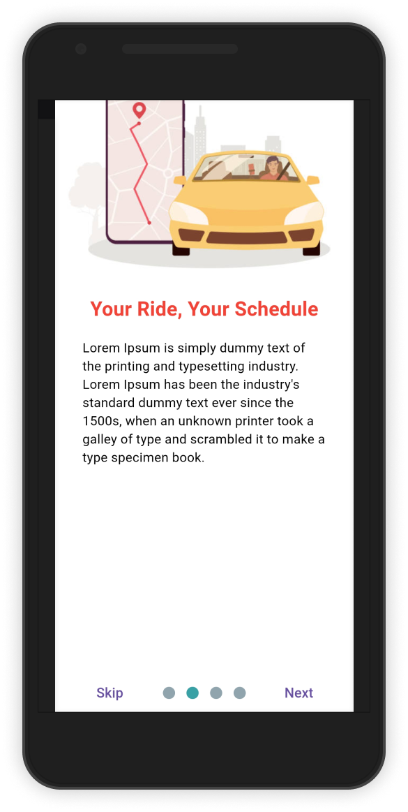
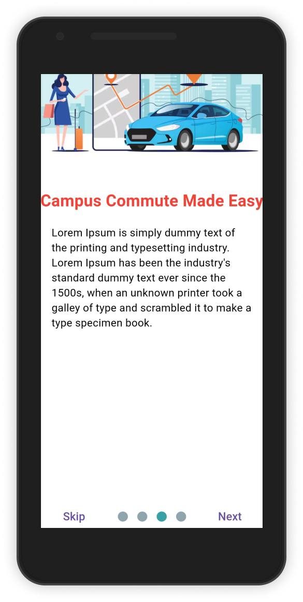
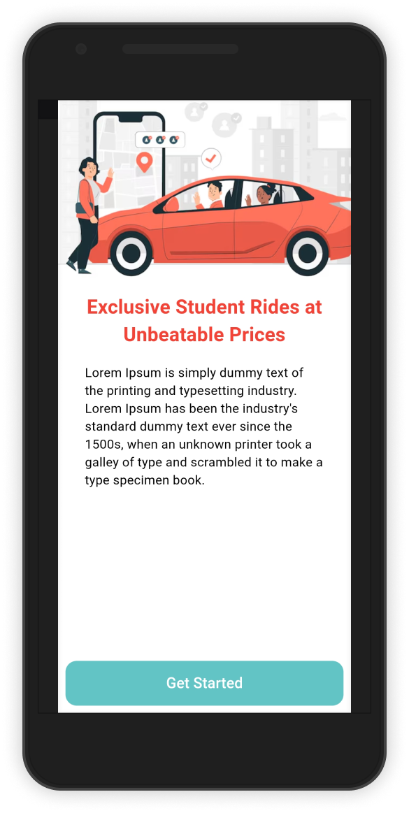
</p>

- **Authentication**
<p align="left">
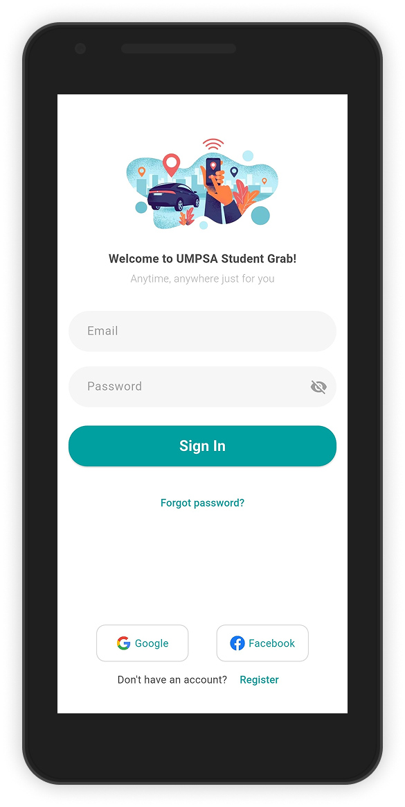
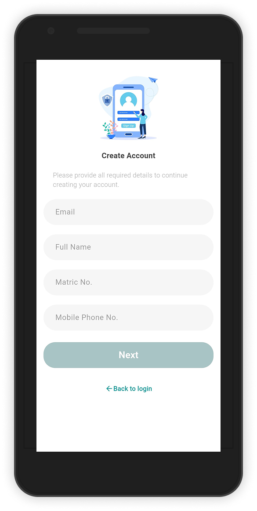
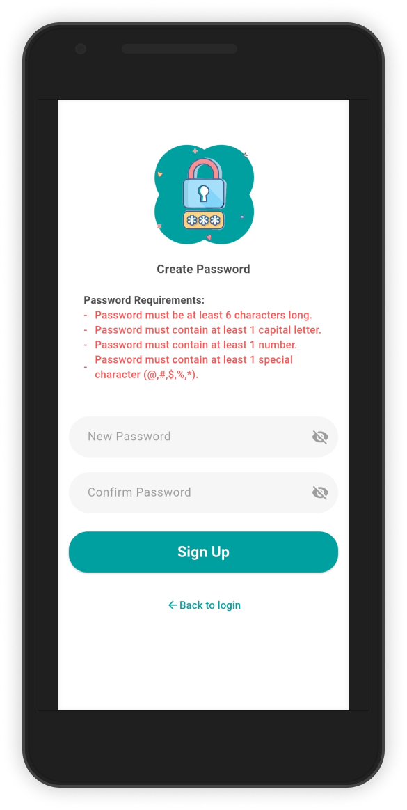
</p>

- **Landing Page**
<p align="left">
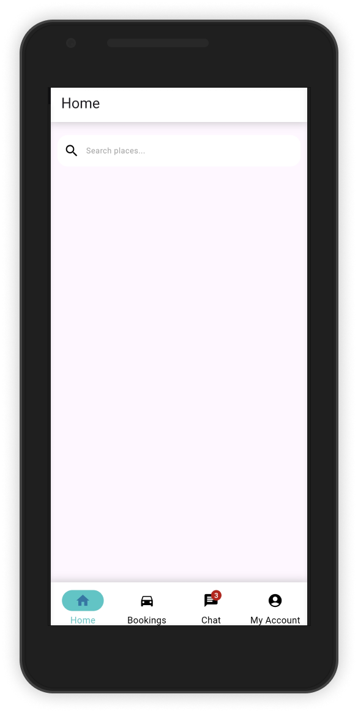
</p>

- **Google Map (Location)**
<p align="left">
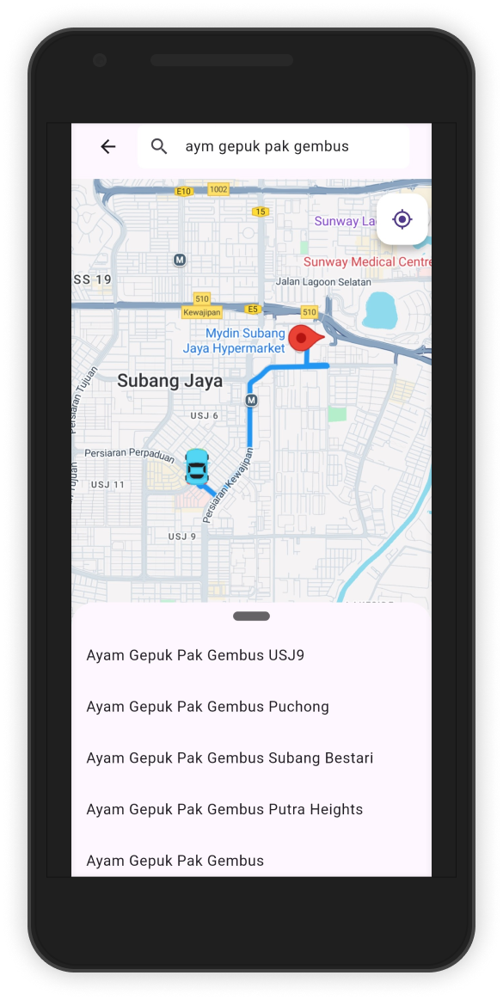
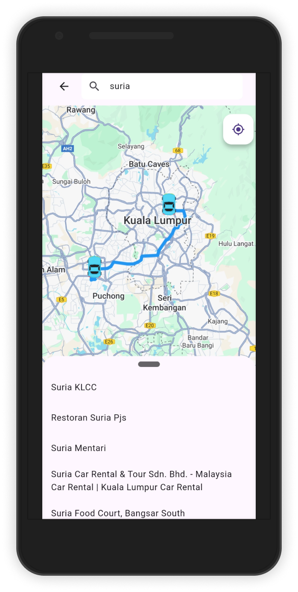
</p>

- **Booking**
<p align="left">
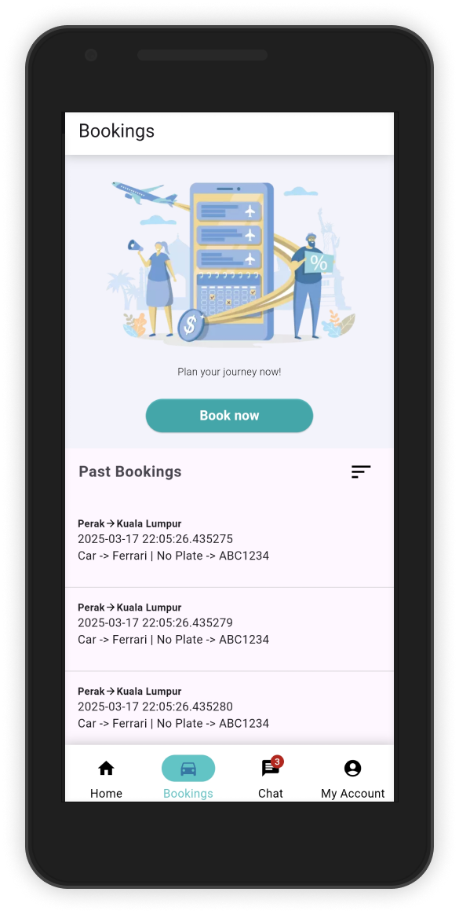
</p>

- **Chat**
<p align="left">
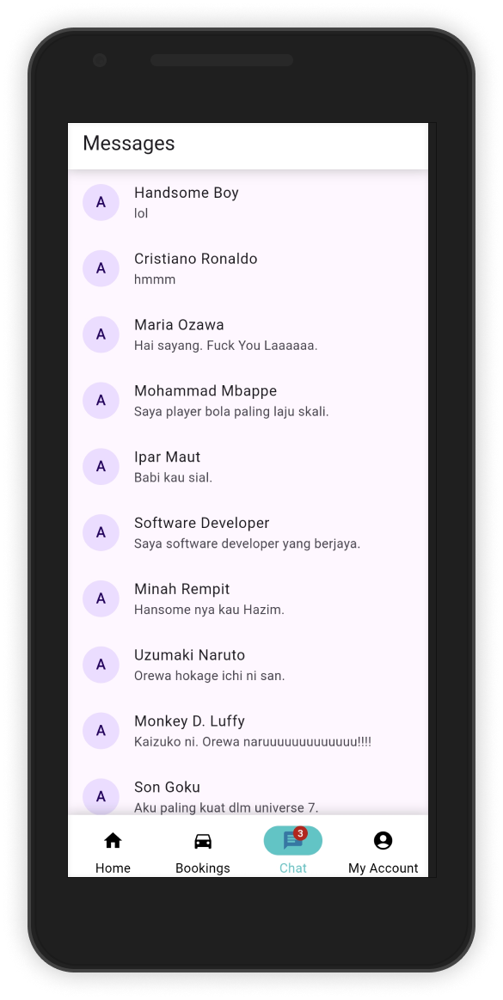

</p>

- **My Account**
<p align="left">
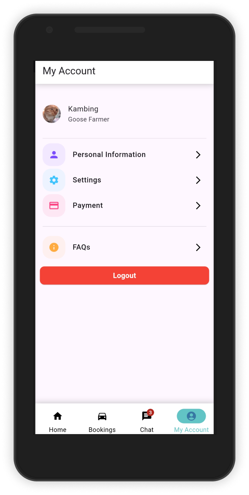
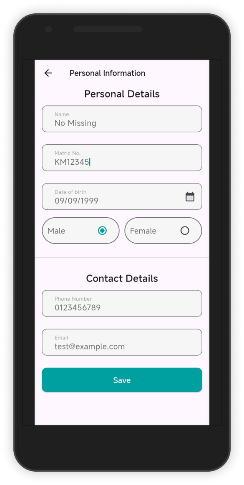
</p>

## Configuration before you can use the app (Server)
**Because im using xampp to run the server. Follow this step if you want to do the same. If you have other option do it yourself.**

1. Start Apache and MySQL in XAMPP.
2. Navigate to the server directory
```
cd YOUR-PATH-TO-PROJECT\ump-student-grab\server
```
3. Go to `src/main/java/resources/application.properties` and update:
- Your XAMPP database credentials.
- (Optional) Your email configuration.
4. Build the project
```
mvn clean install
```
5. Run the application
```
mvn spring-boot:run
```

## Configuration for mobile app (Client)
**I'm using flutter for the mobile app. so there are some configuration need to do.**

1. Open the client folder in seperate window.
```
cd YOUR-PATH-TO-PROJECT\ump-student-grab\client
```
2. Copy sample env file and change configuration according to your need in `.env` file.
```
cp .env.example .env
```
3. Change the `APP_DOMAIN` and `APP_PORT`.
- **Note**: The `APP_DOMAIN` should be your PC's IP address. To find it: 
 - Open your terminal in your pc, type `ipconfig`. Copy the IPv4 Address under `Wireless LAN adapter Wi-Fi`.
- **Note**: Ensure your mobile device and PC are on the same network; otherwise, the app won't work.
4. Update the Google Maps API key

**For Android**
- Go to `android/app/src/main/AndoirdManifest.xml` and replace `YOUR_GOOGLE_MAP_API_KEY` with your key. (Search google how can i get google map api key) (Dont expect semua nk kene suap)
```
<meta-data android:name="com.google.android.geo.API_KEY" android:value="YOUR GOOGLE MAP API KEY"/>
```
**For iOS**
- Go to `ios/Runner/AppDelegate.swift` and replace `YOUR_GOOGLE_MAP_API_KEY with your key.
```
GMSServices.provideAPIKey("YOUR GOOGLE MAP API KEY")
```
5. Run the Flutter application `flutter run`