## `CONNECT ANDROID STUDIO TO YOUR FIREBASE ACCOUNT`

```
1. Go to the Firebase Console (https://console.firebase.google.com/).
```
```
2. Create a new project or select an existing one.
```
```
3. Click on the "Add Firebase to your Android app" button.
```
```
4. Fill in your Android package name, then click on the Register App button. 
   (Your Android Package name must be same with package name in android studio)
   e.g. com.example.ump_student_grab
```
```
5. Leave the SHA certificate blank.
```
```
6. Download the google-services.json file.
```
```
7. Place google-services.json file in app folder of your android studio.
```
```
8. Copy the given dependency for example: (classpath 'com.google.gms:google-services:4.3.3')
```
```
9. Paste it in the build.gradle file(Project) under buildscript->dependencies-> YOUR COPY TEXT
```
```
10. Copy the dependecies given for example: (implementation 'com.google.firebase:firebase-core:17.4.3')
```
```
11. Paste it in the build.gradle file(Module) under dependencies-> YOUR COPY TEXT
```
```
12. In your Android Studio project, click on the "Sync Now" button in the upper right-hand corner.
```

- ADJUST FIREBASE RULE TO READ & WRITE FOR REALTIME (FOR LOCK MODE)
    ```
    PASTE THIS:
    allow read, write: if request.auth !=null;
    ```

- AUTHENTICATION (EMAIL AUTHENTICATION)
    ```
    Enable your email authentication in firebase inside sign in provider section.
    ```

## `Application Overview`

#### Login


### Register
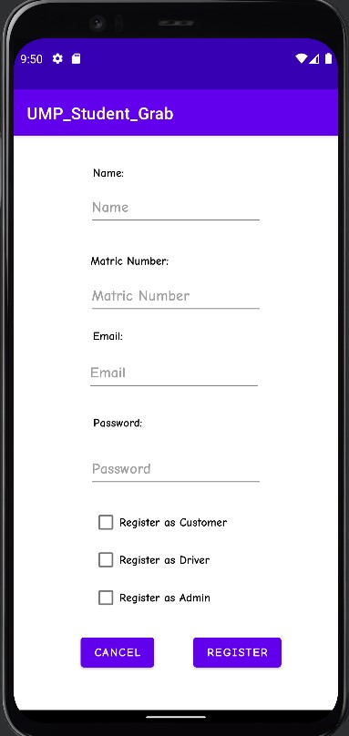

### Forgot Password
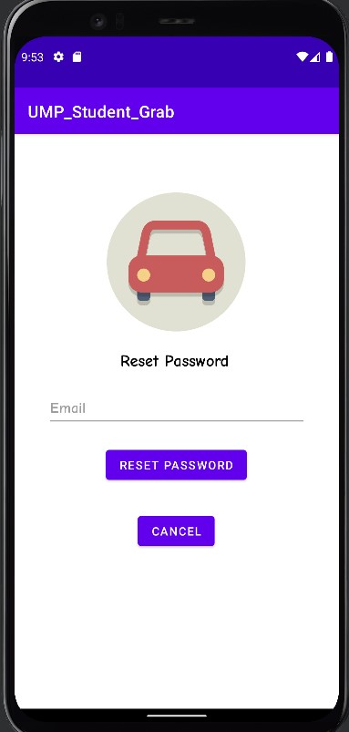

### Customer
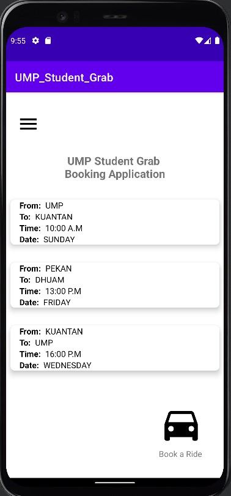
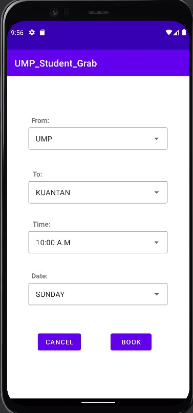
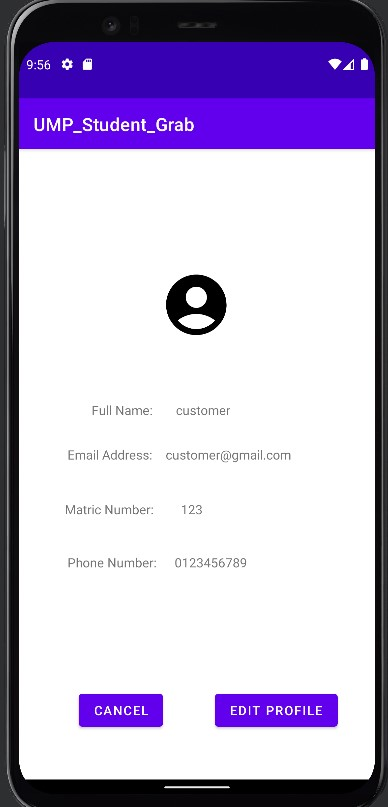
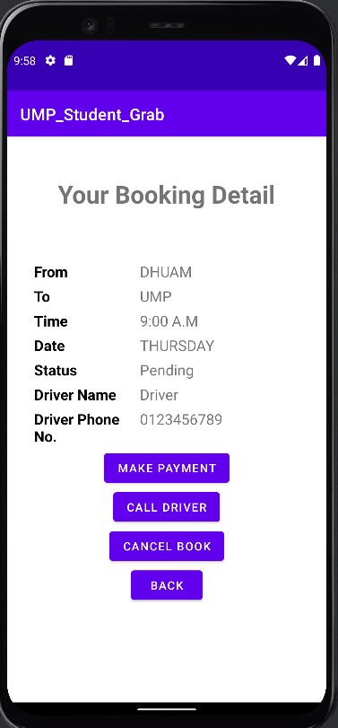
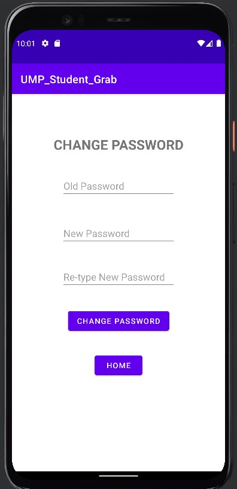
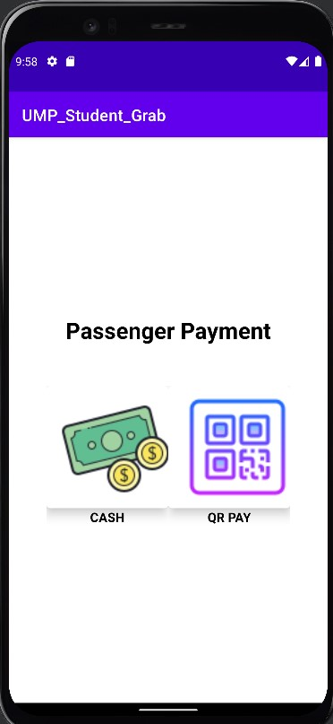
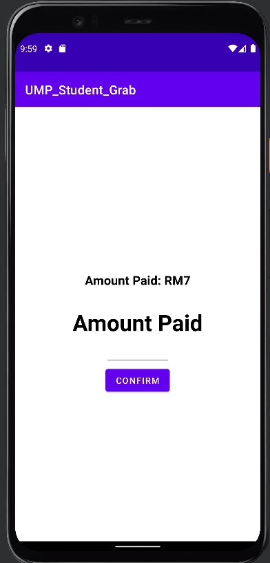
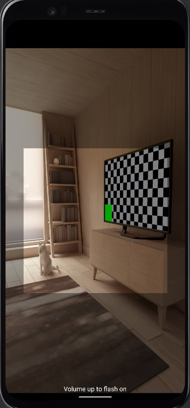

### Driver
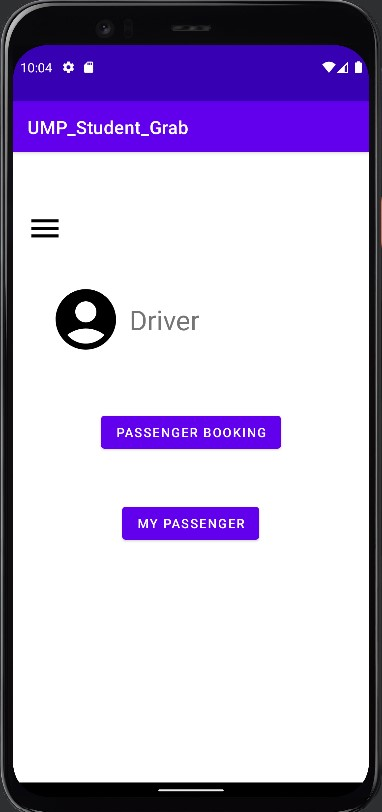
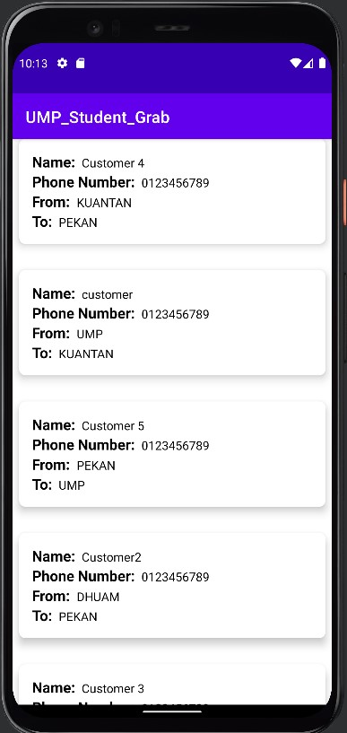
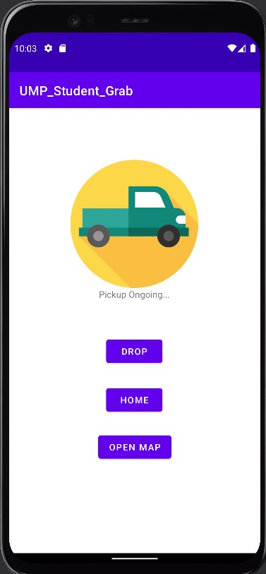
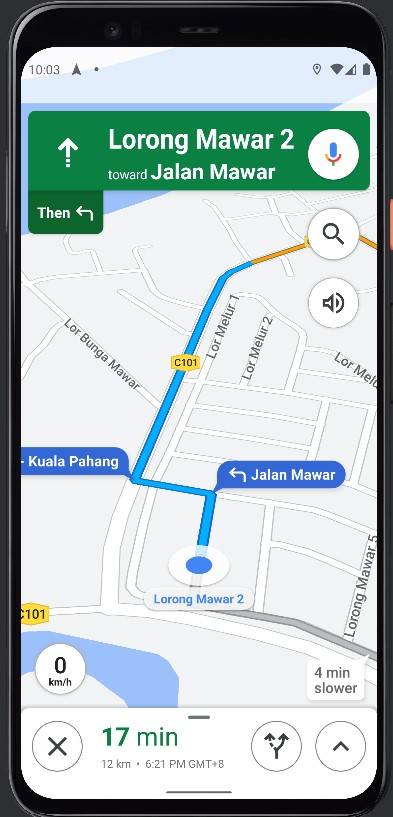

### Admin
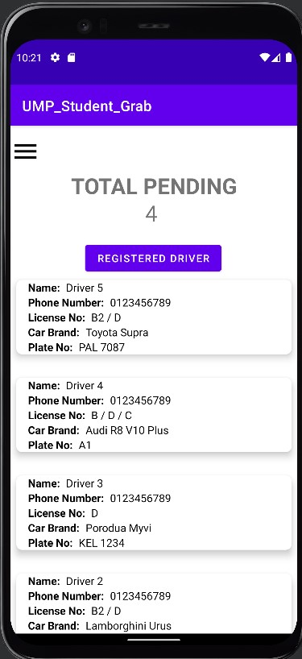
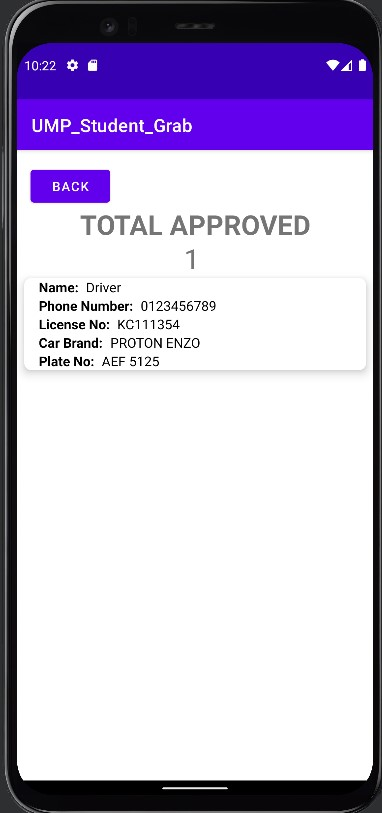
