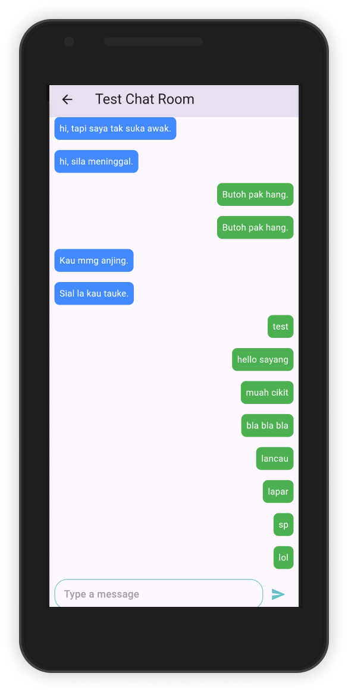

# `UMPSA Student Grab Version 2.0`
- This app is a remake version. Even though it's a remake version, don't expect it to work well. It just looks better than the ugly version 1. If you're interested in seeing the ugly version, you can check the branch v1.

## This app still in progress.
- If i got time :D (LOL)

## Mobile View
- **Welcome Page**
<p align="left">


</p>

- **Login**
<p align="left">

</p>

- **Landing Page**
<p align="left">

</p>

- **Google Map (Location)**
<p align="left">

</p>

- **Booking**
<p align="left">

</p>

- **Chat**
<p align="left">


</p>

- **My Account**
<p align="left">

</p>

## Configuration before you can use the app (Server)
**Because im using xampp to run the server. Follow this step if you want to do the same. If you have other option do yourself.**

1. Run your apache and MySQL server.
2. Open the server folder
```
cd YOUR-PATH-TO-PROJECT\ump-student-grab\server
```
3. Go to `src/main/java/resources/application.properties`. Configure your credential xampp and your email configuration.
4. Run command `mvn clean install`.
5. Run the application `mvn spring-boot:run`

## Configuration for mobile app (Client)
**Im using flutter for the mobile app. so there are some configuration need to do.**

1. Open the client folder in seperate window.
```
cd YOUR-PATH-TO-PROJECT\ump-student-grab\client
```
2. Copy sample env file and change configuration according to your need in ".env" file.
```
cp .env.example .env
```
3. Change the `APP_DOMAIN` and `APP_PORT`.
- Note: The APP_DOMAIN is your pc IP. To get your ip: Open your terminal in your pc, type `ipconfig`. Copy IPV4 address at `Wireless LAN adapter Wi-Fi` section.
- Note that the network need to be same from both your mobile and your pc. Else it will not work.
4. Now go to `android/app/src/main/AndoirdManifest.xml` Change to your google map API KEY for ANDROID (Search google how can i get google map api key) (Dont expect semua nk kene suap)
```
<meta-data android:name="com.google.android.geo.API_KEY" android:value="YOUR GOOGLE MAP API KEY"/>
```
5. Now go to `ios/Runner/AppDelegate.swift` Change to your google map API KEY Also here for IPHONE
```
GMSServices.provideAPIKey("YOUR GOOGLE MAP API KEY")
```
6. Run the application `flutter run`